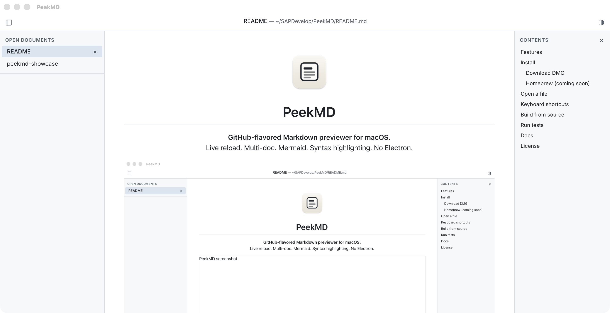

<p align="center">
  
</p>

<h1 align="center">PeekMD</h1>

<p align="center">
  <strong>GitHub-flavored Markdown previewer for macOS.</strong><br>
  Live reload. Multi-doc. Mermaid. Syntax highlighting. No Electron.
</p>

<p align="center">
  
</p>

---

## Features

- **Live reload** — file watcher re-renders the moment you save; viewport jumps to the changed block
- **Multi-document sidebar** — open many files, switch instantly, drag a tab past the window edge to detach it into its own window
- **Syntax highlighting** — fenced code blocks rendered with Syntect (InspiredGitHub light / base16-ocean dark), no inline styles
- **Mermaid diagrams** — `mermaid` fences render to SVG client-side, lazy-loaded, theme-aware
- **TOC rail** — auto-generated table of contents with scroll-spy; appears when headings are present
- **Find in document** — incremental search with match count and prev/next navigation (⌘F)
- **Command palette** — fuzzy-search open files, headings, and commands (⌘K)
- **Session restore** — open documents, scroll positions, and theme survive restarts
- **Light / dark / system theme** — follows macOS appearance by default; override with ⌘⇧L
- **Offline** — no CDN dependencies; all assets bundled, including Mermaid

Built on [Tauri v2](https://tauri.app) + [React 19](https://react.dev) + [comrak](https://github.com/kivikakk/comrak). Renders in WKWebView. ~6 MB app bundle.

## Install

### Homebrew (recommended)

```sh
brew tap cgrossde/homebrew
brew install --cask peekmd
```

After install:
- `open -a PeekMD /path/to/file.md` or double-click any `.md` file.
- `peekmd-cli list` / `peekmd-cli open <path>` are available on `PATH` (used by the PeekMD agent skill).

The cask installs an unsigned build and clears the Gatekeeper quarantine automatically. If macOS still blocks it, run:

```sh
xattr -dr com.apple.quarantine /Applications/PeekMD.app
```

### Download DMG

Download the latest `.dmg` from [Releases](../../releases), drag **PeekMD.app** to `/Applications`.

**First launch on an unsigned build:** right-click the app → **Open**, then confirm. Or remove quarantine from Terminal:

```sh
xattr -dr com.apple.quarantine /Applications/PeekMD.app
```

## Open a file

```sh
# Finder double-click, drag-and-drop, or from the terminal:
open -a PeekMD README.md
```

## Keyboard shortcuts

| Action | Shortcut |
|--------|----------|
| Open file | ⌘O |
| Close document | ⌘W |
| Navigate back / forward | ⌘[ / ⌘] |
| Find in document | ⌘F |
| Command palette | ⌘K |
| Toggle sidebar | ⌘\\ |
| Toggle TOC | ⌘T |
| Toggle theme | ⌘⇧L |
| Switch to doc N | ⌘1 – ⌘9 |
| Reload | ⌘R |

Full list: [docs/keyboard-shortcuts.md](docs/keyboard-shortcuts.md)

## Build from source

**Requirements:** Rust (stable), [Bun](https://bun.sh), Xcode command-line tools.

```sh
git clone https://github.com/cgrossde/PeekMD
cd peekmd
bun install

# Dev server with live reload
bun run tauri dev

# Open a specific file on launch
bun run tauri dev -- -- /path/to/file.md

# Production DMG (unsigned)
bash scripts/release-unsigned.sh
```

## Cut a release

Bump versions, commit, tag, and push — the [release workflow](.github/workflows/release.yml) builds the DMG, publishes a GitHub Release, and updates the Homebrew cask automatically:

```sh
bash scripts/release-tag.sh 0.1.1   # bumps Cargo.toml, tauri.conf.json, package.json
git push && git push --tags          # triggers CI → DMG → GitHub Release → tap update
```

## Run tests

```sh
bun run test                          # frontend unit tests (Vitest)
cd src-tauri && cargo test            # Rust unit tests

bunx playwright test --project=browser   # E2E, no app needed
bunx playwright test --project=tauri     # E2E, requires running app
```

## Docs

- [SPEC.md](SPEC.md) — feature specification
- [docs/](docs/) — architecture, keyboard shortcuts, phase notes

## License

TBD
